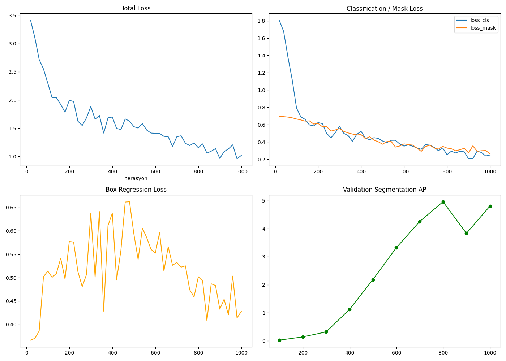
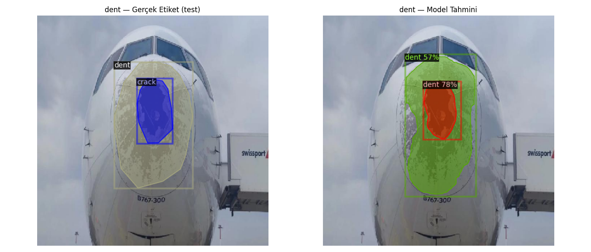

# Mask R-CNN Aircraft Damage Segmentation

Instance segmentation of aircraft part surface damage (dents, cracks) using Mask R-CNN, trained with Detectron2 on a COCO-format labeled dataset.

## Overview

This project applies Mask R-CNN (ResNet-50 FPN backbone) to detect and segment surface damage on aircraft parts. Each damaged region is identified as a separate instance with a pixel-level mask, not just a bounding box — allowing multiple damage instances of the same type to be distinguished within a single image.

## Dataset

| Split | Total Images | Total Annotations |
|-------|:------------:|:------------------:|
| Train | 163 | 563 |
| Valid | 66 | 120 |
| Test | 69 | 120 |

Format: COCO-style annotations (`_annotations.coco.json` per split). The schema defines 6 categories, but only **crack** and **dent** have annotated instances in this dataset.

## Training

- Architecture: Mask R-CNN, ResNet-50 FPN backbone (Detectron2, COCO-pretrained weights as initialization)
- 1000 iterations, batch size 2
- Augmentations: multi-scale resize (640–800px short edge), random horizontal flip



## Results

**Training (final state, evaluated on validation set):**

| Task | AP | AP50 | AP75 |
|------|:--:|:----:|:----:|
| bbox | 7.04 | 19.01 | 3.88 |
| segm | 4.81 | 16.12 | 1.30 |

**Test (final model, `model_final.pth`):**

| Task | AP | AP50 | AP75 |
|------|:--:|:----:|:----:|
| bbox | 4.29 | 8.39 | 3.44 |
| segm | 2.50 | 7.87 | 0.29 |

### Sample prediction



## Limitations & Next Steps

AP values are low in absolute terms, which is expected given the current setup rather than a bug:

- **Small dataset**: only 163 training images is limited for a model as capacity-heavy as Mask R-CNN
- **Short training**: 1000 iterations is a small budget; the validation AP curve was still trending upward at the end of training, suggesting the model hadn't converged
- **Class imbalance**: only 2 of 6 schema categories have any labeled instances, which drags down aggregate metrics

Planned improvements: gathering more labeled images, longer training with learning-rate scheduling, and addressing class imbalance (oversampling or focal loss).

## Project Structure

\```
├── notebooks/
│   └── mask_rcnn_training.ipynb   # training & evaluation notebook
├── outputs/
│   ├── egitim_grafikleri.png      # training/validation AP curves
│   ├── temsili_karsilastirma.png  # sample prediction visualization
│   ├── metrics.json               # full training metrics log
│   ├── coco_eval/                 # periodic validation evaluation results
│   ├── eval_my_dataset_valid/     # final model evaluation on validation set
│   └── eval_my_dataset_test/      # final model evaluation on test set
└── README.md
\```

## Requirements

- Python, PyTorch, [Detectron2](https://github.com/facebookresearch/detectron2)
- COCO-format labeled dataset (not included in this repo — see `.gitignore`)